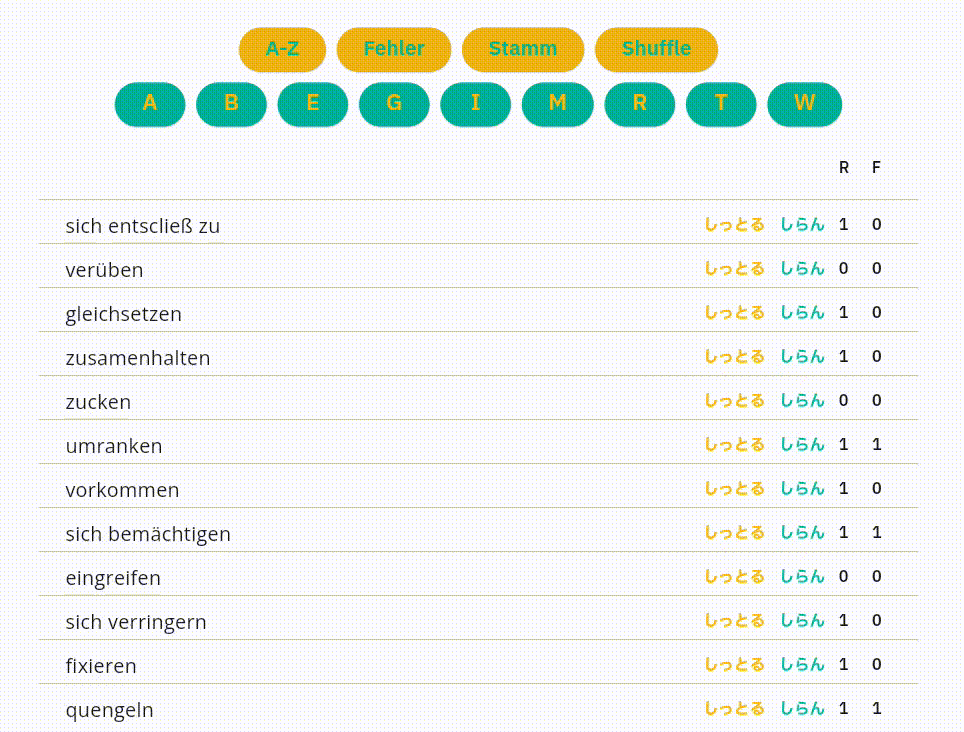

# Flet app to remember German verbs 2

## Screen record




## Motivation

I tried several ready-made apps designed to help build a foreign
language vocabulary, but none of them met my needs. Therefore, I
decided to create my own.

### Feature

* simple
* fast
* just ask `know` or `do not know`


## How to Run in Your Browser
To run the app:

```
flet run --web --port 8011
```

Then, open `http://localhost:8011` in your browser.

Note: `8011` can be replaced with any port number you prefer.  
Refer to the [Flet official page](https://flet.dev/) for more details.

## Preparation

### Create a Vocabulary Table

The required format is:


```
[verb], [meaning], [times you tried], [times you failed]
```

```
> head ./assets/verben.csv
potenzieren, 高める 強める, 0, 0
überlassen, 任せる , 0, 0
erlassen, 免除する 発布する , 0, 0
...
```

-------------------------
# END
